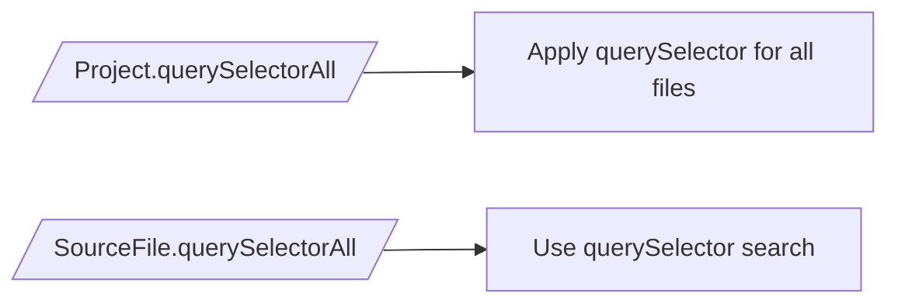

## querySelectors system prototype for ts-morph lib

- Using https://www.npmjs.com/package/css-what for parsing selectors
- Like the engine css checks in childs-parents (left-right) direction
- Designed as a lazy generator (but without caching)

- [x] Create api
- [ ] // todofetch in parents
- [ ] Дойти до всех листьев
  - [x] ~~создать метод хелпер для выбора всех листьев~~ (ошибочная навязчивая мысль)



```ts
project.querySelectorAll(
	"file[name='123'] > class:not([name='my_class']) keyword[var]" 
)
	.forEach(node => node.replaceWithText("let"))
```

## Theoretical basis for an effective system
- api for retrieving all leaves of a graph with caching
- a lazy generator for traversing leaves with condition checking using internal caching within a single search context

